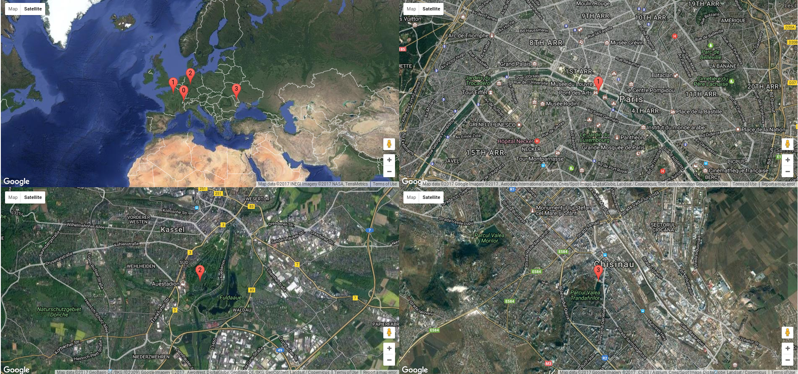

# Overview

Set of simple tools using stem python to monitor and control tor:

* `tor-map`: open a Google maps of the whole circuit and each nodes with the default system browser

* `tor-circuit`: display detailed information about the circuit nodes (ip, nickname, reverse DNS, geoip, fingerprint, whois output, nmap output)

# Installation

1. Package installation

		# pip install pywhois stem python-nmap
		# dpkg -i tor-control-tk_0.1.deb

2. Open a tor control port

		# echo 'ControlPort 9051' >> /etc/tor/torrc
		# service tor restart
